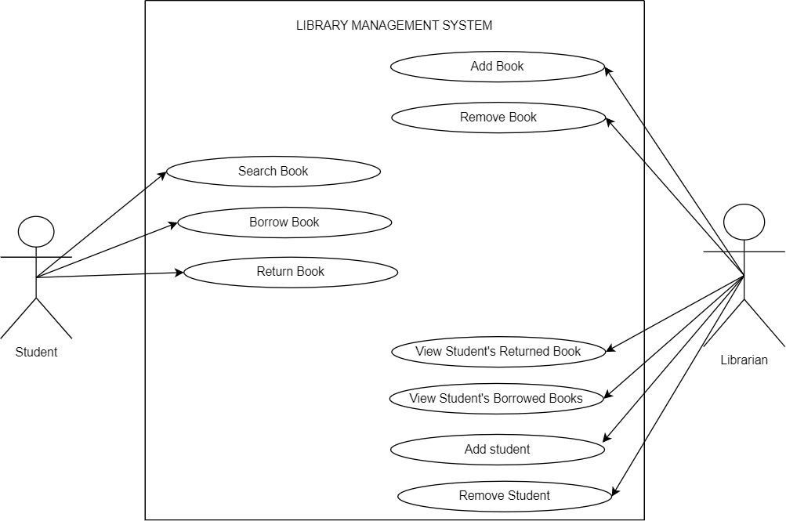
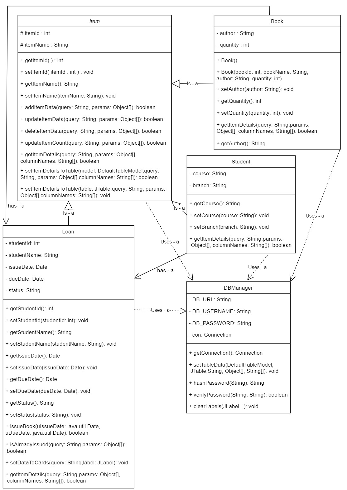
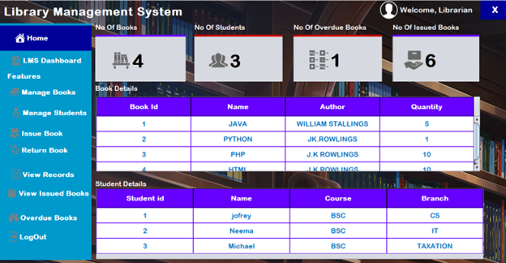
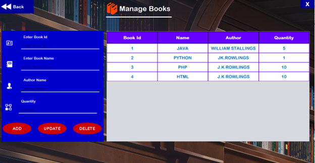
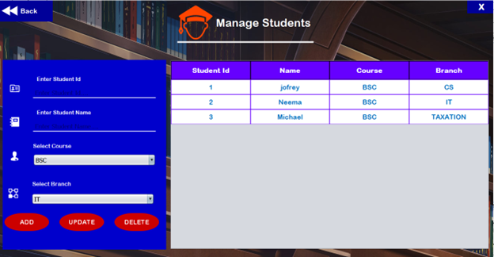
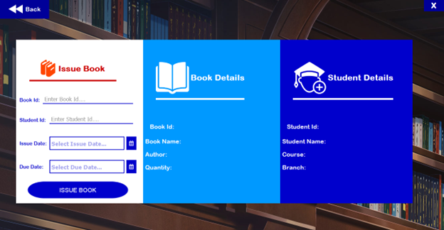
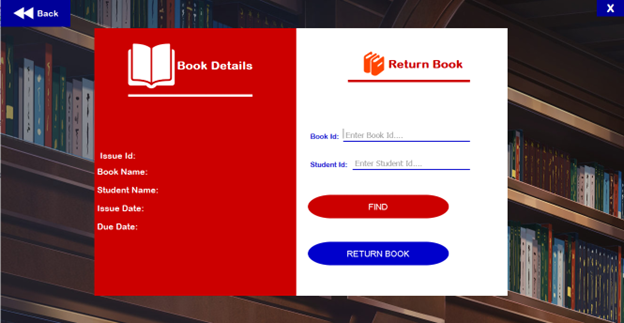
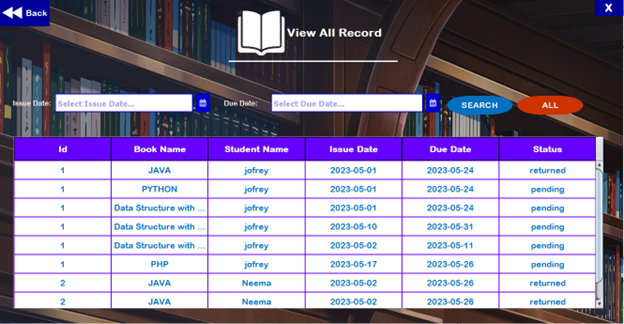
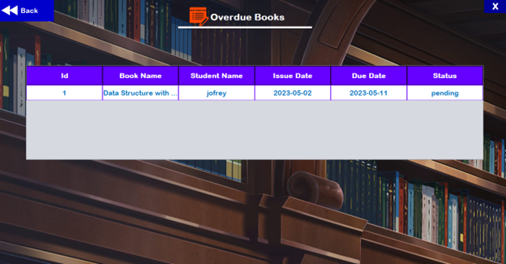
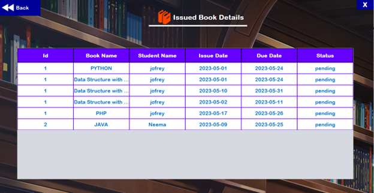

<!-- PROJECT SHIELDS -->
[![Contributors][contributors-shield]][contributors-url]
[![Forks][forks-shield]][forks-url]
[![Stargazers][stars-shield]][stars-url]
[![Issues][issues-shield]][issues-url]
[![MIT License][license-shield]][license-url]
[![LinkedIn][linkedin-shield]][linkedin-url]

<!-- PROJECT LOGO -->
<div align="center">
  <h3>Library Management System</h3>
  <p>An automated library management system for efficient book and student management.</p>
</div>

<!-- TABLE OF CONTENTS -->
<details>
  <summary>Table of Contents</summary>
  <ol>
    <li><a href="#about-the-project">About The Project</a></li>
    <li><a href="#getting-started">Getting Started</a></li>
    <li><a href="#usage">Usage</a></li>
    <li><a href="#roadmap">Roadmap</a></li>
    <li><a href="#contributing">Contributing</a></li>
    <li><a href="#license">License</a></li>
    <li><a href="#contact">Contact</a></li>
    <li><a href="#acknowledgments">Acknowledgments</a></li>
  </ol>
</details>

<!-- ABOUT THE PROJECT -->
## About The Project

The Library Management System is a Java-based application designed to automate and streamline various activities in a library. It simplifies the management of books, students, and book transactions within a library.

### Purpose
The system aims to:
- Simplify book management, student registration, and book transactions.
- Allow librarians to perform tasks like adding, updating, and removing books.
- Manage student details and book borrowing/returning.
- Generate reports for data analysis.

### Scope
The system includes:
- Book management (add, update, remove, search).
- Student management (add, update, remove, search).
- Borrowing and returning books.
- Report generation.

<!-- GETTING STARTED -->
## Getting Started

To set up the Library Management System locally, follow these steps:

### Prerequisites
- Java development environment.
- Relational database management system (DBMS).

### Installation
1. Clone the repository:
   ```sh
   git clone https://github.com/slymackjr/library.git
   ```

2. Compile and run the Java application.

<!-- USAGE -->
## Usage

The Library Management System is designed to automate and streamline various activities in a library. It provides the following functionalities:

- **Book Management:**
   - Add new books to the library's collection.
   - Update book information, including title, author, ISBN, and quantity.
   - Remove books from the system.
   - Search for books based on ISBN or ID.

- **Student Management:**
   - Add new students to the system, capturing information such as student name, ID, course, and branch.
   - Update student records to reflect any changes in student information.
   - Remove students from the system if needed.
   - Search for students based on their name or ID.

- **Borrowing and Returning Books:**
   - Students can borrow books by providing their student ID and the book ID.
   - The system checks the availability of the book and updates its availability status accordingly.
   - Borrowing details, including the due date, are recorded in the system.
   - Students can return books, and the system updates the book's availability status and records the return information.

- **Reporting:**
   - Generate reports for data analysis and administrative purposes.
   - Customize reports based on parameters such as date range, book categories, or student information.
   - View, print, or export generated reports in PDF format.

The system aims to streamline library operations, improve efficiency, and provide a user-friendly interface for librarians and students to interact with the library's resources and services.

### Design and Implementation

The system includes the following key pages and features:

- **Login Page**
- **Signup Page**
- **Home Page**
- **Manage Book Page**
- **Manage Students Page**
- **Issue Book Page**
- **Return Book**
- **View All Record Page**
- **Overdue Book Page**
- **Issue Book Details Page**

Additionally, here is the UML Class Diagram and Use Case Diagram illustrating the system's design.

<div style="display: flex; flex-direction: column; align-items: center; overflow-y: auto; max-height: 400px;">


</div>


### Image Carousel Slider

Here is an image carousel slider showcasing some of the system's features:

<div style="display: flex; overflow-x: auto; white-space: nowrap;">
  
  
  
  
  
  
  
  
  
  
</div>


Feel free to explore and utilize the Library Management System for efficient library management.

<!-- ROADMAP -->
## Roadmap

- [x] Add book management functionality.
- [x] Implement student management.
- [x] Create borrowing and returning features.
- [ ] Add reporting capabilities.
- [ ] Enhance user interface.

See the [open issues](https://github.com/slymackjr/library/issues) for a list of proposed features and known issues.

<!-- CONTRIBUTING -->
## Contributing

Contributions are welcome! Please follow these steps to contribute to the project:

1. Fork the Project
2. Create your Feature Branch (`git checkout -b feature/AmazingFeature`)
3. Commit your Changes (`git commit -m 'Add some AmazingFeature'`)
4. Push to the Branch (`git push origin feature/AmazingFeature`)
5. Open a Pull Request

<!-- LICENSE -->
## License

Distributed under the MIT License. See `LICENSE.txt` for more information.

<!-- CONTACT -->
## Contact

Jofrey Boniphace Nyamasheki - [My Twitter](https://twitter.com/Slymackjr) - jbnyamasheki@gmail.com

Project Link: [https://github.com/slymackjr/library](https://github.com/slymackjr/library)

<!-- ACKNOWLEDGMENTS -->
## Acknowledgments

- [Choose an Open Source License](https://choosealicense.com)
- [GitHub Emoji Cheat Sheet](https://www.webpagefx.com/tools/emoji-cheat-sheet)
- [Malven's Flexbox Cheatsheet](https://flexbox.malven.co/)
- [Malven's Grid Cheatsheet](https://grid.malven.co/)
- [Img Shields](https://shields.io)
- [GitHub Pages](https://pages.github.com)
- [Font Awesome](https://fontawesome.com)
- [React Icons](https://react-icons.github.io/react-icons/search)

<!-- MARKDOWN LINKS & IMAGES -->
[contributors-shield]: https://img.shields.io/github/contributors/slymackjr/library.svg?style=for-the-badge
[contributors-url]: https://github.com/slymackjr/library/graphs/contributors
[forks-shield]: https://img.shields.io/github/forks/slymackjr/library.svg?style=for-the-badge
[forks-url]: https://github.com/slymackjr/library/network/members
[stars-shield]: https://img.shields.io/github/stars/slymackjr/library.svg?style=for-the-badge
[stars-url]: https://github.com/slymackjr/library/stargazers
[issues-shield]: https://img.shields.io/github/issues/slymackjr/library.svg?style=for-the-badge
[issues-url]: https://github.com/slymackjr/library/issues
[license-shield]: https://img.shields.io/github/license/slymackjr/library.svg?style=for-the-badge
[license-url]: https://github.com/slymackjr/library/blob/library/LICENSE.txt
[linkedin-shield]: https://img.shields.io/badge/-LinkedIn-black.svg?style=for-the-badge&logo=linkedin&colorB=555
[linkedin-url]: https://www.linkedin.com/in/jofrey-nyamasheki-9bb8781ab


